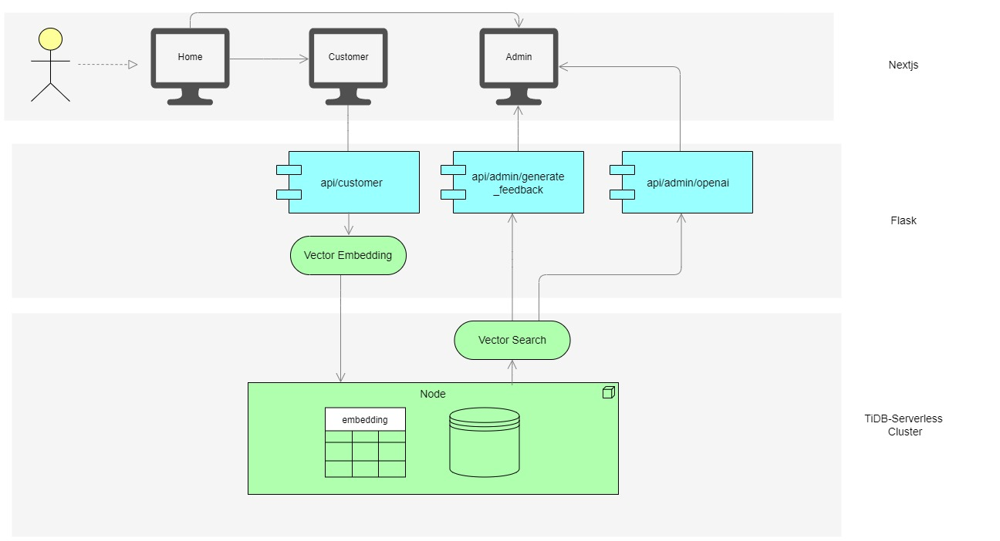

# {Feed!tBack}

An AI based feedback collection and management system for Growing Businesses



## Getting Started

### Local Development

Note: The following steps are valid for only Windows OS

Prerequisites:

- `npm`
- `pip`
- `ollama`

Start with Cloning the repository

```bash
git clone https://github.com/Avinash-Acharya/FeeditBack.git
```

Navigate to the Root folder and install the necessary node packages

```bash
npm i
```

Now navigate to the /api folder and create an virtual environment and activate it

```bash
cd api
python -m venv myenv
myenv/Scripts/activate
```

Install the necessary Python Libraries

```bash
pip install -r requirements.txt
```

Create a `.env` file in the Root folder and add a field `TIDB_DATABASE_URL` and enter the TiDB Connection String which looks like `mysql+pymysql://{TIDB_USER}:{TIDB_PASSWORD}@{TIDB_HOST}:{TIDB_PORT}/{TIDB_DB_NAME}?ssl_verify_cert=True&ssl_verify_identity=True`

We will use ollama to run LLM models locally, So Install Ollama from [here](https://ollama.com/) and run the below command

```bash
ollama pull phi3:3.8b-mini-128k-instruct-q4_K_M
```

Note : We even provide an option for openAPI key intigration on Admin page, So you can skip running Ollama locally.

###Running Devlopment Server
You can achieve this in two ways:

**First:**
By running a single command which runs both Nextjs and Flask server

```bash
npm run final
```

Note: Wait till the below message shows up

```bash
[0]   ▲ Next.js 14.2.4
[0]   - Local:        http://localhost:3000
[0]   - Environments: .env
[0]
[0]  ✓ Starting...
[0]  ✓ Ready in 6.8s
[1]  * Serving Flask app 'index'
[1]  * Debug mode: off
[1] WARNING: This is a development server. Do not use it in a production deployment. Use a production WSGI server instead.
[1]  * Running on http://127.0.0.1:5000
[1] Press CTRL+C to quit
```

**OR**

**Second:**
By running them each separately

Run the Nextjs development server

```bash
npm run dev2
```

And finall run Flask server in the /api folder

```bash
cd api
python app.py
```

Now we got both Nextjs and Flask running on port [http://localhost:3000](http://localhost:3000) and [http://127.0.0.1:5000](http://127.0.0.1:5000) respectively.

Open [http://localhost:3000](http://localhost:3000) with your browser to see the result.
